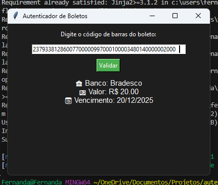

<h1 align="center">  💵 Autenticador de Boletos Bancários com Python</h1>

## Descrição do Projeto

O **Autenticador de Boletos** é um sistema simples e eficaz desenvolvido com Python, que permite ao usuário:
- Ler códigos de barras de boletos bancários por imagem (escaneando o código) ou por digitação manual;
- Validar e extrair informações essenciais como **valor**, **data de vencimento** e **banco emissor**;
- Realizar testes e visualizar os dados diretamente em uma interface local de terminal.

Este projeto foi criado para usabilidade prática e validações reais de estrutura de boletos, muito utilizado em bancos brasileiros.

## Funcionalidades do Projeto

-  Leitura de boletos via **imagem com código de barras**
-  Digitação direta do código de barras
-  Identificação do banco emissor
-  Cálculo do valor do boleto
-  Leitura da data de vencimento
-  Validação da estrutura do código digitado
-  Interface local simples e rápida via terminal

## Testes de Software

### Testes realizados:
- **Teste de depuração:** Tratamento de falhas ao ler imagens ou digitar códigos inválidos;
- **Teste de funcionamento:** Foram testados boletos com diferentes bancos e valores;
- **Captura de teste realizado:**

  

## Tecnologias e Linguagens 

## Bibliotecas e Frameworks

## Licença

Este projeto está licenciado sob a Licença MIT.  
Veja o arquivo [LICENSE](LICENSE) para mais detalhes.

--- 

    Desenvolvido por <a href="https://github.com/AraujoTech1">Fernanda Araujo</a> 

